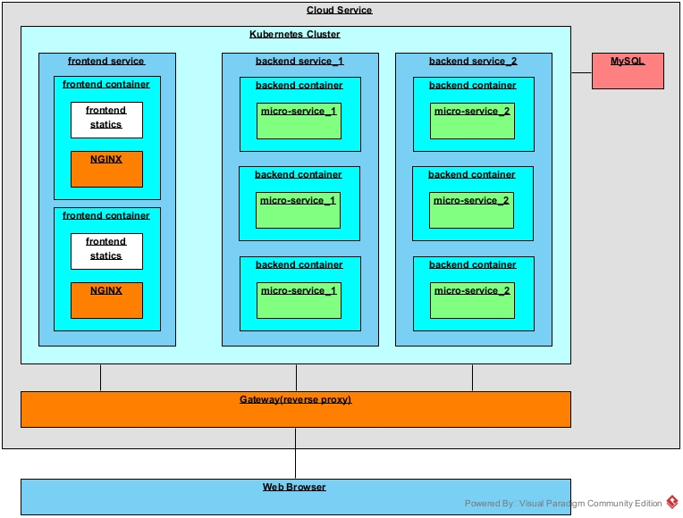

# 技术规格说明书


## 一、整体结构



部署在云服务器上，数据库直接使用云服务商提供的MySQL数据库服务，使用云服务器构建k8s集群，然后通过反向代理的网关进行路由转发。

后端为微服务结构，每一个微服务单独在一个docker容器中运行。前端资源暂时也部署在k8s集群上，通过NGINX作为服务器进行分发，每一个容器中都包含前端的全部资源。

## 二、技术栈

### 1. 前端

* 语言：HTML+CSS+JavaScript
* 框架：[Vue.js](https://cn.vuejs.org/)
* 部署环境：[docker|nginx](https://hub.docker.com/_/nginx)
* 运行环境：Web浏览器

### 2. 后端-用户中心

* 语言：Java
* 框架：SpringBoot+Mybatis
* 运行环境：[docker|openjdk:8-jre](https://hub.docker.com/_/openjdk)

### 3. 后端-编码转换器

* 语言：Java
* 框架：SpringBoot+Mybatis
* 运行环境：[docker|openjdk:8-jre](https://hub.docker.com/_/openjdk)


## WebAPI设计

### url

访问各个微服务的RESTful接口面向外部的url格式为：

```
/api/${micro_service.name}/${inner_path}
```

而在集群内，只需`${inner_path}`即可访问（前面需要加上`http://localhost:61234`之类的）。

而其余url将被转发值部署前端的`NGINX`服务器进行处理。

### API文档

API文档使用[Apifox](https://www.apifox.cn/)进行构造，导出`OpenAPI（Swagger 3.0）`、`HTML`、`Apifox`三种格式存放在仓库中。

【**注意**】请不要通过编辑器打开导出的html文件，因为其将所有内容打包在一个html文件中，直接打开会很卡。

### API设计偏好

当传输时间时，尽量采用`时间戳`+**可选的**`时间字符串`，`时间字符串`主要用于方便调试，结束调试后，可以选择删除该字段，所以程序的运行不应该依赖于`时间字符串`。

