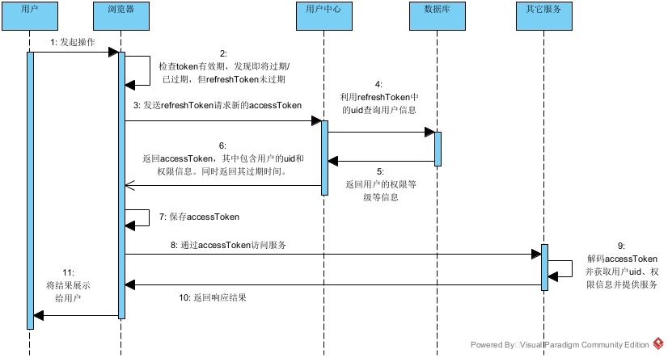

# 登录与用户管理需求分析与功能设计

## 需求分析

~~网站设计上为工具网站，即一个应用的集合网站，每个应用间的独立性较高，作为微服务分别进行独立开发，每个应用都可能有不同的用户控制的需求，而我们希望能够统一进行管理。用户经过一次登录就可以使用所有工具，管理员可以通过一个页面来统一管理不同应用的不同用户的权限。因此，我们需要一个单点登录的授权服务器，兼顾用户的管理，作为一个独立的应用进行开发。~~

~~此时，我们需要有安全控制，一方面，授权服务器要能够鉴别应用不是伪造的，另一方面，应用服务器也要能够鉴别授权服务器不是伪造的。~~

~~单点登录后，出于用户隐私信息的考虑，应当让用户确认授权。但是每个应用都需要确认授权是十分影响体验的，所以引入白名单机制，当应用处于白名单时，可以跳过授权确认。~~

~~进一步地，我们希望有定时的权限升级，管理员应该可以方便地设置升级后的权限和持续时间，既可以直接指定用户进行升级，也可以生成激活码。~~

~~登录控制应当有基本的安全控制，如密码加密。~~

2021/8/1 把上面都删掉了。

网站设计上为小工具集合网站，目前没有盈利目标，也不涉及充值相关的内容，用户登录主要是有些工具可能需要保存状态。因此，用户登录的设计，主要应当考虑用户的便捷性。

对于大部分用户而言，他们只希望登录一次，就可以使用所有功能，而不要使用一个工具就注册一个账号。

对于一般用户，他们应当期望的是可以直接使用网站提供的功能，注册和登录是一个耽误事情和时间的过程，所以如果使用功能前需要先进行注册，就可能导致用户的流失，所以应当为他们提供不需要登录的流程。如果该服务本身就是无状态的，那么可以完全无需登录，直接使用，但是如果服务本身是有状态的，则为用户创建一个临时账号，这个账号的凭证保存在浏览器中，同时存在刷新机制，来刷新凭证的有效期、延长用户临时账号的生命周期。

对于需要跨设备使用的用户，他们对于网站一般会比较熟悉，有进一步的需求，所以他们普遍可以接受注册登录流程。但是他们很可能存在丢失密码的情况，应当有一定机制进行账号密码的找回。同时，注册用户也会希望减少重新登录的情况，尽量不要出现不注册反而比注册要方便得多的情况，让注册操作本身作为用户几乎唯一的额外操作，所以应当提供记住登录状态的功能。

对于未注册用户向注册用户迁移的过程，用户通常希望保存未注册时的状态。可以考虑直接将原先的临时账户提升至注册用户，但同时需要注意禁用原先临时账户的凭证。

## 名词解释

1. 用户：指使用本网站的自然人；
2. 客户端：用户使用的浏览器等；
3. 账户：指服务器中保存的用户的状态信息的集合；
   1. 已注册账户：绑定了邮箱，并且已经设置好密码的账户；
   2. 未注册账户：又称临时账户，由系统自动生成，有一定有效期，超过有效期后将被删除的用户；
4. 凭证：加密的，可以验证未被篡改的一段字符串/字节序列，用于标识一个账户；
   1. 访问凭证：用于直接访问各个服务；
   2. 刷新凭证：用于获取访问凭证，刷新凭证分为临时账户的凭证和注册账户的凭证；

## 功能设计

进行按等级的权限控制，权限从高至低依次为`管理员`、`用户`、`游客`。未注册账户拥有权限等级`游客`，当未注册账户绑定邮箱设置密码后，变为已注册账户，权限自动升级为`用户`。管理员账号必须是已注册账户，只有管理员有权限将已注册账户的权限提升至管理员。

凭证中包含UID，以及账户的权限等级，这样服务就无须访问数据库便可以获取一定用户信息。为了缓解用户权限发生更改单凭证无法及时同步的问题，通过`访问凭证`与`刷新凭证`双凭证进行授权的鉴权，`访问凭证`具有较短的有效期，`刷新凭证`具有较长的有效期。用户可以通过`访问凭证`访问服务，`访问凭证`中包含UID和用户权限等级；而`刷新凭证`只能用于获取新的访问凭证，以及换取新的`刷新凭证`。当使用`刷新凭证`获取访问凭证时，都将访问数据库，将数据库中的权限等级作为`访问凭证`的权限等级，这样就能使得在极端情况下，`访问凭证`中的权限信息只有较短时间与数据库中不一致。

以下为访问凭证过期但刷新凭证未过期时，用户访问有权限要求的服务的流程：

此外，未注册账户有一定有效期，未注册账户的`刷新凭证`有效期应当短于未注册账户的有效期，当`刷新凭证`的有效期过半后，前端应当提示用户，得到用户许可后向后端发起请求获取新的`刷新凭证`，此时后端在返回新的`刷新凭证`的同时，也应当延长该未注册用户的有效期。未注册账户的有效期初始较短，但随着用户的使用，应当逐渐变长。前端应当提示用户正在使用未注册账户，说明有效期，并引导用户进行绑定注册。

未注册账户超出有效期后，应当被删除。

## 功能列表

### 1. 临时账户注册

不需要单独的前端页面，只需要后端响应即可。当其余服务的需要临时的账户时，向用户服务发送请求，用户服务将创建一个临时账户，并返回该临时账户的刷新凭证。该凭证应当有一定有效期，当超出有效期时，后端应当清理用户的信息，前端应当在用户的计算机本地保存该凭证。

### 2. 换取刷新凭证

不需要单独的前端页面，只需要后端响应即可。当前端检查到凭证的有效期过半，前端应当向用户提示，获取用户许可后，通过旧凭证向后端换取新的凭证。如果该凭证对应一个临时账户，后端还需要延长该账户的有效期。

### 3. 获取访问凭证

不需要单独的前端页面，只需要后端响应即可。通过刷新凭证，获取访问凭证。该操作将检查数据库，如果数据库中该用户的权限和刷新凭证中的不一致

### 4. 登录

通过邮箱密码进行登录，若存在一个注册账户满足该邮箱密码，则返回一个注册账户的刷新凭证，前端应当保存该凭证，如果用户选择在当前计算机记住该用户，应当将该凭证进行持久化。

### 5. 注册

为一个未注册账户绑定邮箱和密码，使其有效期无限延长。应当通过验证码验证邮箱的有效性。

